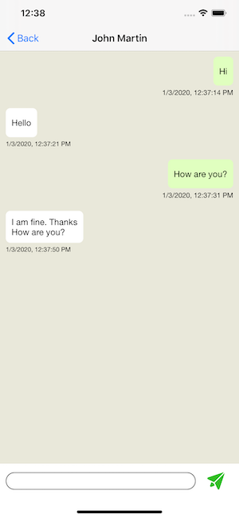

# Achieve the real-time chat using Socket IO with the MVVM desing pattern.

This project will let you know that how we can build a chat application by using the Socket IO library. Also this project is using the MVVM desing pattern and generic observer for data binding between ViewController and ViewModel.

For the full tutorial, Please check this [Medium](https://medium.com/p/8f32b1401aa5/)

This is join chat room screen where user can join the chat by clicking on "JOIN CHAT" button.
 

This is the participant list screen.

 

This is the message list screen where user can communicate to each other.

# By Apple 

Xcode 11.1
iOS 13

# LICENSE!

socket-chat is [MIT-licensed](/LICENSE).

